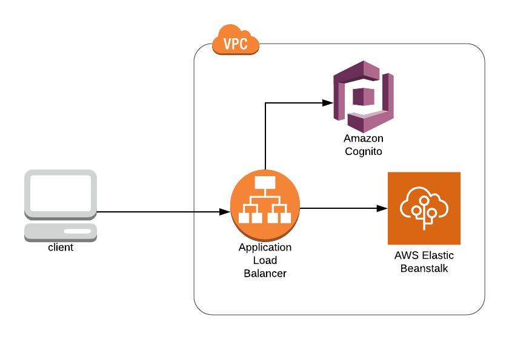

# cli-eb-example

AWS CLI guide to provide an example for how to deploy an ElasticBeanstalk (EB) Docker Streamlit application authenticated with a local Cognito user pool.



## Prerequisites for guides

- AWS account
- User [AdministratorAccess](https://docs.aws.amazon.com/IAM/latest/UserGuide/access_policies_job-functions.html#jf_administrator)
- [AWS CLI](https://docs.aws.amazon.com/cli/latest/userguide/install-cliv2.html)
- [Build/Push Docker image to ECR](../app/README.md#buildingpushing-docker-image-to-aws)
- AWS default region of [`us-east-1`](https://docs.aws.amazon.com/cli/latest/userguide/cli-chap-configure.html#cli-quick-configuration)

## Setup

Before starting, be sure that you've followed the [instructions](../app/README.md#buildingpushing-docker-image-to-aws) for building the example Docker image and pushing to ECR.

**It is strongly recommend that you save the output of all the commands you run as there are values that will be ouput that will be needed for later commands.**

We will be building up to a working application by following these steps:

1. Create ElasticBeanstalk (EB) application
    1. Deploy configuration
        1. Create S3 bucket
        1. Copy configuration to S3 bucket
    1. Create EB application version
    1. Create IAM role and Instance Profile for EC2 instance to use to pull Docker image from Elastic Container Registry (ECR)
    1. Request SSL certificate with Amazon Certificate Manager (ACM)
    1. Create DNS record with ACM DNS value to validate certificate (assumed that you have a domain you can use and know how to create DNS records)
    1. Create EB environment
    1. Create DNS CNAME record for EB application (aws-eb-example.streamlit.io in this guide)
    1. Navigate to site
1. Update default Security Group to allow internet traffic to connect
1. Setup AWS Cognito
    1. Create local user pool (instead of connecting to an IDP as that is not the purpose of this guide)
    1. Create an applicaiton to use to connect to Cognito
    1. Create a domain for Cognito to use
    1. Create first user for Cognito
1. Update Application Load Balancer (ALB)
    1. Modify ALB Listener Rule to:
        1. Authenticate users with Cognito
        1. Route request to Target Group and ultimately to container

### Create ElasticBeanstalk (EB) application

These steps will configure an EB application running a Docker container for our streamlit application.

#### Deploy configuration

ElasticBeanstalk needs to pull configuration from one of three places:  CodeCommit, S3, or CodeBuild. For this guide, we will be pulling from S3.

##### Create S3 bucket

First we will create an S3 bucket to store our EB configuration.

```
aws s3api create-bucket \
  --acl private \
  --bucket 123456789012-elasticbeanstalk-us-east-1
```

This will return output like this:

```
{
    "Location": "/123456789012-elasticbeanstalk-us-east-1"
}
```

#### Copy configuration to S3 bucket

We will then create our EB configuration `Dockerrun.aws.json` file for deploying our EB Docker application.

```Dockerrun.aws.json
{
  "AWSEBDockerrunVersion": "1",
  "Image": {
    "Name": "123456789012.dkr.ecr.us-east-1.amazonaws.com/streamlit-example:1"
  },
  "Ports": [
    {
      "ContainerPort": "8501"
    }
  ]
}
```


Then we will upload that to our bucket for use when creating the application.

```
aws s3 cp Dockerrun.aws.json s3://123456789012-elasticbeanstalk-us-east-1/Dockerrun.aws.json
```

This will return output like this:

```
upload: ./Dockerrun.aws.json to s3://123456789012-elasticbeanstalk-us-east-1/Dockerrun.aws.json
```

#### Create EB application version

With our configuration uploaded to S3, we can now create our application version.

```
aws elasticbeanstalk create-application-version \
  --application-name streamlit \
  --version-label v0.0.1 \
  --source-bundle S3Bucket=123456789012-elasticbeanstalk-us-east-1,S3Key=Dockerrun.aws.json \
  --auto-create-application
```

This will return output like this:

```
{
    "ApplicationVersion": {
        "ApplicationVersionArn": "arn:aws:elasticbeanstalk:us-east-1:123456789012:applicationversion/streamlit/v0.0.1",
        "ApplicationName": "streamlit",
        "VersionLabel": "v0.0.1",
        "SourceBundle": {
            "S3Bucket": "123456789012-elasticbeanstalk-us-east-1",
            "S3Key": "Dockerrun.aws.json"
        },
        "DateCreated": "2020-05-29T02:31:53.825Z",
        "DateUpdated": "2020-05-29T02:31:53.825Z",
        "Status": "UNPROCESSED"
    }
}
```

#### Create IAM role and Instance Profile for EC2 instance to use to pull Docker image from Elastic Container Registry (ECR)

The IAM role is needed so that EB can pull the Docker image onto the EC2 instance that is created for the application. Run the four commands below to:

1. Create IAM role
1. Attach the AWS managed policy for pulling ECR images
1. Create an Instance Profile
1. Add the IAM role to the Instance Profile

```
aws iam create-role \
  --role-name streamlit-elasticbeanstalk-role \
  --assume-role-policy-document '{"Version":"2012-10-17","Statement":[{"Effect":"Allow","Principal":{"Service":"ec2.amazonaws.com"},"Action":"sts:AssumeRole"}]}'

aws iam attach-role-policy \
  --role-name streamlit-elasticbeanstalk-role \
  --policy-arn arn:aws:iam::aws:policy/AmazonEC2ContainerRegistryReadOnly

aws iam create-instance-profile \
  --instance-profile-name streamlit-elasticbeanstalk-instance-profile

aws iam add-role-to-instance-profile \
  --instance-profile-name streamlit-elasticbeanstalk-instance-profile \
  --role-name streamlit-elasticbeanstalk-role
```

#### Request SSL certificate with Amazon Certificate Manager (ACM)

In order to use Cognito authentication with your ALB, it is required that you use TLS on the ALB listener. In order to configure TLS, we will need a SSL certificate which can be requested/managed through the Amazon Certificate Manager service (replacing `streamlit.io` with your domain).

```
aws acm request-certificate \
  --domain-name streamlit.io \
  --subject-alternative-names "*.streamlit.io" \
  --validation-method DNS
```

This will return output like this:

```
{
    "CertificateArn": "arn:aws:acm:us-east-1:123456789012:certificate/aaaaaaaa-1111-2222-3333-bbbbbbbbbbbb"
}
```

####  Create DNS record with ACM DNS value to validate certificate

This will create a DNS record that will need to be added to your domain. Use the Amazon Resource Name (ARN) from the command above to query and get the DNS CNAME record you need to add.

```
aws acm describe-certificate \
  --certificate-arn arn:aws:acm:us-east-1:123456789012:certificate/aaaaaaaa-1111-2222-3333-bbbbbbbbbbbb \
  --query 'Certificate.DomainValidationOptions[0]'
```

This will return output like this:

```
{
    "DomainName": "streamlit.io",
    "ValidationDomain": "streamlit.io",
    "ValidationStatus": "PENDING_VALIDATION",
    "ResourceRecord": {
        "Name": "_fe11e6d33b981de0a491ad26bcd6ba11.streamlit.io.",
        "Type": "CNAME",
        "Value": "_4ace5aa56fec33b8cb9945bf19d22dd5.auiqqraehs.acm-validations.aws."
    },
    "ValidationMethod": "DNS"
}
```

Use the `ResourceRecord` information to create the DNS record to validate the certificate. This might take a bit for ACM to validate the certificate but keep checking the status of the certificate by running the `aws acm describe-certificate` command and waiting until the output returns `SUCCESS` for the `ValidationStatus` like the below example output:

```
{
    "DomainName": "streamlit.io",
    "ValidationDomain": "streamlit.io",
    "ValidationStatus": "SUCCESS",
    "ResourceRecord": {
        "Name": "_fe11e6d33b981de0a491ad26bcd6ba11.streamlit.io.",
        "Type": "CNAME",
        "Value": "_4ace5aa56fec33b8cb9945bf19d22dd5.auiqqraehs.acm-validations.aws."
    },
    "ValidationMethod": "DNS"
}
```

#### Create EB environment

Once the ACM certificate has been validated, it will be ready for use with our EB application.

We will begin by creating an `options.json` file for our non default configuration of the EB application:

```options.json
[
    {
        "Namespace": "aws:elasticbeanstalk:environment",
        "OptionName": "LoadBalancerType",
        "Value": "application"
    },
    {
        "Namespace": "aws:autoscaling:launchconfiguration",
        "OptionName": "IamInstanceProfile",
        "Value": "streamlit-elasticbeanstalk-instance-profile"
    },
    {
        "Namespace": "aws:elbv2:loadbalancer",
        "OptionName": "SecurityGroups",
        "Value": "sg-f4b372d7"
    },
    {
        "Namespace": "aws:elbv2:listener:default",
        "OptionName": "ListenerEnabled",
        "Value": "false"
    },
    {
        "Namespace": "aws:elbv2:listener:443",
        "OptionName": "Protocol",
        "Value": "HTTPS"
    },
    {
        "Namespace": "aws:elbv2:listener:443",
        "OptionName": "SSLCertificateArns",
        "Value": "arn:aws:acm:us-east-1:123456789012:certificate/aaaaaaaa-1111-2222-3333-bbbbbbbbbbbb"
    },
    {
        "Namespace": "aws:elbv2:listener:443",
        "OptionName": "SSLPolicy",
        "Value": "ELBSecurityPolicy-TLS-1-2-Ext-2018-06"
    }
]
```

With the file created, we can now start the creation of our application environment. Use a unique `--cname-prefix` as this is a global CNAME record and `streamlit-example` is used by this guide and may not be available.

```
aws elasticbeanstalk create-environment \
  --application-name streamlit \
  --version-label v0.0.1 \
  --environment-name example \
  --cname-prefix streamlit-example \
  --solution-stack-name "64bit Amazon Linux 2 v3.0.1 running Docker" \
  --option-settings file://options.json
```

This will return output like this:

```
{
    "EnvironmentName": "example",
    "EnvironmentId": "e-aabbccddee",
    "ApplicationName": "streamlit",
    "VersionLabel": "v0.0.1",
    "SolutionStackName": "64bit Amazon Linux 2 v3.0.1 running Docker",
    "PlatformArn": "arn:aws:elasticbeanstalk:us-east-1::platform/Docker running on 64bit Amazon Linux 2/3.0.1",
    "CNAME": "streamlit-example.us-east-1.elasticbeanstalk.com",
    "DateCreated": "2020-05-29T02:31:57.442Z",
    "DateUpdated": "2020-05-29T02:31:57.442Z",
    "Status": "Launching",
    "Health": "Grey",
    "Tier": {
        "Name": "WebServer",
        "Type": "Standard",
        "Version": "1.0"
    },
    "EnvironmentArn": "arn:aws:elasticbeanstalk:us-east-1:123456789012:environment/streamlit/example"
}
```

#### Create DNS CNAME record for EB application (aws-eb-example.streamlit.io in this guide)

With our application created and our ACM certificate of `*.streamlit.io`, we will create a DNS CNAME record for the EB application.

We will point `streamlit-example.us-east-1.elasticbeanstalk.com` to `aws-eb-example.streamlit.io` (remember to substitute your value for the `--cname-prefix` from above).

### Update default Security Group to allow internet traffic to connect

### Update default Security Group to allow internet traffic to connect

Finally, update the default security group to allow ingress traffic (this will not return any output):

```
aws ec2 authorize-security-group-ingress \
  --group-name default \
  --protocol tcp \
  --port 443 \
  --cidr 0.0.0.0/0
```

#### Navigate to site

At this point, you should be able to navigate to your streamlit application via https://aws-eb-example.streamlit.io which should present a validate certificate and your example application.

### Setup AWS Cognito

There are many ways to configure authentication, especially with Identity Providers (IDPs) through AWS Cognito but for now we will configure a local AWS Cognito user pool to use for securing access to the Streamlit application.

#### Create local user pool

```
aws cognito-idp create-user-pool \
  --pool-name streamlit-example-user-pool \
  --admin-create-user-config AllowAdminCreateUserOnly=true
```

This will return output like this:

```
{
    "UserPool": {
        "Id": "us-east-1_aaaaaaaaa",
        "Name": "streamlit-example-user-pool",
        "Policies": {
            "PasswordPolicy": {
                "MinimumLength": 8,
                "RequireUppercase": true,
                "RequireLowercase": true,
                "RequireNumbers": true,
                "RequireSymbols": true,
                "TemporaryPasswordValidityDays": 7
            }
        },
        "LambdaConfig": {},
        "LastModifiedDate": 1589585785.725,
        "CreationDate": 1589585785.725,
        "SchemaAttributes": [
            ...
            {
                "Name": "name",
                "AttributeDataType": "String",
                "DeveloperOnlyAttribute": false,
                "Mutable": true,
                "Required": false,
                "StringAttributeConstraints": {
                    "MinLength": "0",
                    "MaxLength": "2048"
                }
            },
            ...
            {
                "Name": "email",
                "AttributeDataType": "String",
                "DeveloperOnlyAttribute": false,
                "Mutable": true,
                "Required": false,
                "StringAttributeConstraints": {
                    "MinLength": "0",
                    "MaxLength": "2048"
                }
            },
            {
                "Name": "email_verified",
                "AttributeDataType": "Boolean",
                "DeveloperOnlyAttribute": false,
                "Mutable": true,
                "Required": false
            },
            ...
        ],
        "VerificationMessageTemplate": {
            "DefaultEmailOption": "CONFIRM_WITH_CODE"
        },
        "MfaConfiguration": "OFF",
        "EstimatedNumberOfUsers": 0,
        "EmailConfiguration": {
            "EmailSendingAccount": "COGNITO_DEFAULT"
        },
        "AdminCreateUserConfig": {
            "AllowAdminCreateUserOnly": true,
            "UnusedAccountValidityDays": 7
        },
        "Arn": "arn:aws:cognito-idp:us-east-1:123456789012:userpool/us-east-1_aaaaaaaaa"
    }
}
```

If you did not get the `Id` from the above command (first attribute in the `UserPool` object at the top of the output), it can be found by running the command below and locating the `streamlit-example-user-pool` and copying the `Id` value for creating the application client.

```
aws cognito-idp list-user-pools --max-results 10
```

#### Create an applicaiton to use to connect to Cognito

The above command provides the `Id` we will need for the next command to create the App client to be used by the ALB.

```
aws cognito-idp create-user-pool-client \
  --user-pool-id us-east-1_aaaaaaaaa \
  --client-name streamlit \
  --generate-secret \
  --allowed-o-auth-flows-user-pool-client \
  --allowed-o-auth-flows "code" \
  --allowed-o-auth-scopes "openid" \
  --explicit-auth-flows "ALLOW_REFRESH_TOKEN_AUTH" "ALLOW_USER_PASSWORD_AUTH" \
  --supported-identity-providers "COGNITO" \
  --callback-urls "https://aws-eb-example.streamlit.io/oauth2/idpresponse" "https://streamlit.auth.us-east-1.amazoncognito.com/saml2/idpresponse"
```

The output of the command would look like this:

```
{
    "UserPoolClient": {
        "UserPoolId": "us-east-1_aaaaaaaaa",
        "ClientName": "streamlit",
        "ClientId": "abcdefghijklmnopqrstuvwxyz",
        "ClientSecret": "abcdefghijklmnopqrstuvwxyz01234567890abcdefghijklmn",
        "LastModifiedDate": 1589586829.921,
        "CreationDate": 1589586829.921,
        "RefreshTokenValidity": 30,
        "ExplicitAuthFlows": [
            "ALLOW_USER_PASSWORD_AUTH",
            "ALLOW_REFRESH_TOKEN_AUTH"
        ],
        "SupportedIdentityProviders": [
            "COGNITO"
        ],
        "CallbackURLs": [
            "https://aws-eb-example.streamlit.io/oauth2/idpresponse",
            "https://streamlit.auth.us-east-1.amazoncognito.com/saml2/idpresponse",
        ],
        "AllowedOAuthFlows": [
            "code"
        ],
        "AllowedOAuthScopes": [
            "openid"
        ],
        "AllowedOAuthFlowsUserPoolClient": true
    }
}
```

Be sure to save off the value of the `ClientId` key for later when creating the listener on the ALB.

#### Create a domain for Cognito to use

Next we'll create a domain for use by the App client (this will not return any output).

```
aws cognito-idp create-user-pool-domain \
  --user-pool-id us-east-1_aaaaaaaaa \
  --domain streamlit
```

#### Create first user for Cognito

Finally, let's create our first user.

1. Substitute `newuser` with your desired username (could be your email)
1. Substitute `newuser@streamlit.io` with your email so you will get the temporary password

```
aws cognito-idp admin-create-user \
  --user-pool-id us-east-1_aaaaaaaaa \
  --username newuser@streamlit.io \
  --user-attributes Name=email,Value=newuser@streamlit.io \
  --desired-delivery-mediums "EMAIL"
```

This will return the user information:

```
{
    "User": {
        "Username": "newuser@streamlit.io",
        "Attributes": [
            {
                "Name": "sub",
                "Value": "b090cc58-bed2-44cf-8672-93d0c265f391"
            },
            {
                "Name": "email",
                "Value": "newuser@streamlit.io"
            }
        ],
        "UserCreateDate": 1589587141.158,
        "UserLastModifiedDate": 1589587141.158,
        "Enabled": true,
        "UserStatus": "FORCE_CHANGE_PASSWORD"
    }
}
```

### Modify ALB Listener Rule to

We need to modify the ALB Listener Rule that was created for the application to have the ALB enforce Cognito authentication.

First we'll get the resources that were create with the EB environment:

```
aws elasticbeanstalk describe-environment-resources \
  --environment-name example
```

This will return output like this:

```
{
    "EnvironmentResources": {
        "EnvironmentName": "example",
        "AutoScalingGroups": [
            {
                "Name": "awseb-e-aabbccddee-stack-AWSEBAutoScalingGroup-ABCDEFGHIJK"
            }
        ],
        "Instances": [
            {
                "Id": "i-01234567890123456"
            }
        ],
        "LaunchConfigurations": [
            {
                "Name": "awseb-e-aabbccddee-stack-AWSEBAutoScalingLaunchConfiguration-AAAABBBBCCCC"
            }
        ],
        "LaunchTemplates": [],
        "LoadBalancers": [
            {
                "Name": "arn:aws:elasticloadbalancing:us-east-1:123456789012:loadbalancer/app/awseb-AWSEB-1234ABCD45678/aaaabbbbccccdddd"
            }
        ],
        "Triggers": [],
        "Queues": []
    }
}
```

We will use the `LoadBalancers` from the above output to get the `ListenerArn` and `TargetGroupArn`:

```
aws elbv2 describe-listeners \
  --load-balancer-arn arn:aws:elasticloadbalancing:us-east-1:123456789012:loadbalancer/app/awseb-AWSEB-1234ABCD45678/aaaabbbbccccdddd
```

This will return output like this:

```
{
    "Listeners": [
        {
            "ListenerArn": "arn:aws:elasticloadbalancing:us-east-1:123456789012:listener/app/awseb-AWSEB-1234ABCD45678/aaaabbbbccccdddd/1234abcd5678efgh",
            "LoadBalancerArn": "arn:aws:elasticloadbalancing:us-east-1:123456789012:loadbalancer/app/awseb-AWSEB-1234ABCD45678/aaaabbbbccccdddd",
            "Port": 443,
            "Protocol": "HTTPS",
            "Certificates": [
                {
                    "CertificateArn": "arn:aws:acm:us-east-1:123456789012:certificate/aaaaaaaa-1111-2222-3333-bbbbbbbbbbbb"
                }
            ],
            "SslPolicy": "ELBSecurityPolicy-TLS-1-2-Ext-2018-06",
            "DefaultActions": [
                {
                    "Type": "forward",
                    "TargetGroupArn": "arn:aws:elasticloadbalancing:us-east-1:123456789012:targetgroup/awseb-AWSEB-1234ABCD45678/12345678abcdefgh",
                    "ForwardConfig": {
                        "TargetGroups": [
                            {
                                "TargetGroupArn": "arn:aws:elasticloadbalancing:us-east-1:123456789012:targetgroup/awseb-AWSEB-1234ABCD45678/12345678abcdefgh",
                                "Weight": 1
                            }
                        ],
                        "TargetGroupStickinessConfig": {
                            "Enabled": false
                        }
                    }
                }
            ]
        }
    ]
}
```

We will create an `actions.json` to define the Cognito Authentication on the ALB before routing to the application:

```actions.json
[
  {
    "Type": "authenticate-cognito",
    "AuthenticateCognitoConfig": {
      "UserPoolArn": "arn:aws:cognito-idp:us-east-1:123456789012:userpool/us-east-1_aaaaaaaaa",
      "UserPoolClientId": "abcdefghijklmnopqrstuvwxyz",
      "UserPoolDomain": "streamlit",
      "SessionCookieName": "AWSELBAuthSessionCookie",
      "SessionTimeout": 3600,
      "Scope": "openid",
      "OnUnauthenticatedRequest": "authenticate"
    },
    "Order": 1
  },
  {
    "Type": "forward",
    "TargetGroupArn": "arn:aws:elasticloadbalancing:us-east-1:123456789012:targetgroup/streamlit-example/0123456789abcdef",
    "Order": 2
  }
]
```

We will use the values retrieved from above to modify the listener with the command below:

```
aws elbv2 modify-listener \
  --listener-arn arn:aws:elasticloadbalancing:us-east-1:123456789012:listener/app/awseb-AWSEB-1234ABCD45678/aaaabbbbccccdddd/1234abcd5678efgh \
  --protocol HTTPS
  --port 443
  --ssl-policy ELBSecurityPolicy-TLS-1-2-Ext-2018-06
  --certificates CertificateArn=arn:aws:acm:us-east-1:123456789012:certificate/aaaaaaaa-1111-2222-3333-bbbbbbbbbbbb \
  --default-actions file://actions.json
```

This will return output like this:

```
{
    "Listeners": [
        {
            "ListenerArn": "arn:aws:elasticloadbalancing:us-east-1:123456789012:listener/app/awseb-AWSEB-1234ABCD45678/aaaabbbbccccdddd/1234abcd5678efgh",
            "LoadBalancerArn": "arn:aws:elasticloadbalancing:us-east-1:123456789012:loadbalancer/app/awseb-AWSEB-1234ABCD45678/aaaabbbbccccdddd",
            "Port": 443,
            "Protocol": "HTTPS",
            "Certificates": [
                {
                    "CertificateArn": "arn:aws:acm:us-east-1:123456789012:certificate/aaaaaaaa-1111-2222-3333-bbbbbbbbbbbb"
                }
            ],
            "SslPolicy": "ELBSecurityPolicy-TLS-1-2-Ext-2018-06",
            "DefaultActions": [
                {
                    "Type": "authenticate-cognito",
                    "AuthenticateCognitoConfig": {
                        "UserPoolArn": "arn:aws:cognito-idp:us-east-1:123456789012:userpool/us-east-1_aaaaaaaaa",
                        "UserPoolClientId": "abcdefghijklmnopqrstuvwxyz",
                        "UserPoolDomain": "streamlit",
                        "SessionCookieName": "AWSELBAuthSessionCookie",
                        "Scope": "openid",
                        "SessionTimeout": 3600,
                        "OnUnauthenticatedRequest": "authenticate"
                    },
                    "Order": 1
                },
                {
                    "Type": "forward",
                    "TargetGroupArn": "arn:aws:elasticloadbalancing:us-east-1:123456789012:targetgroup/awseb-AWSEB-1234ABCD45678/12345678abcdefgh",
                    "Order": 2,
                    "ForwardConfig": {
                        "TargetGroups": [
                            {
                                "TargetGroupArn": "arn:aws:elasticloadbalancing:us-east-1:123456789012:targetgroup/awseb-AWSEB-1234ABCD45678/12345678abcdefgh",
                                "Weight": 1
                            }
                        ],
                        "TargetGroupStickinessConfig": {
                            "Enabled": false
                        }
                    }
                }
            ]
        }
    ]
}
```

### Login to newly created application

Check your newly deployed application (https://aws-eb-example.streamlit.io for this guide).

You will be prompted to login with the username that we created earlier. You should have gotten an email with your temporary password.
