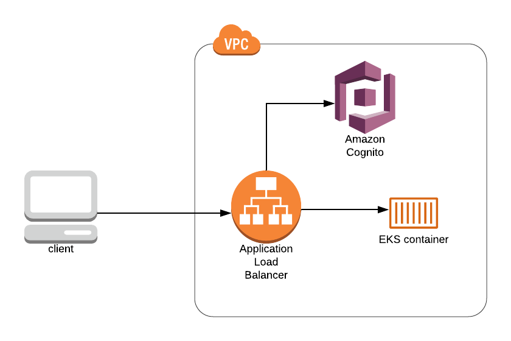

# cli-eks-example

AWS CLI guide to provide an example for how to deploy an EKS Streamlit application authenticated with a local Cognito user pool.



## Prerequisites for guides

- AWS account
- User [AdministratorAccess](https://docs.aws.amazon.com/IAM/latest/UserGuide/access_policies_job-functions.html#jf_administrator)
- [AWS CLI](https://docs.aws.amazon.com/cli/latest/userguide/install-cliv2.html)
- [helm](https://helm.sh/)
- [Build/Push Docker image to ECR](../app/README.md#buildingpushing-docker-image-to-aws)
- AWS default region of [`us-east-1`](https://docs.aws.amazon.com/cli/latest/userguide/cli-chap-configure.html#cli-quick-configuration)

## Setup

Before starting, be sure that you've followed the [instructions](../app/README.md#buildingpushing-docker-image-to-aws) for building the example Docker image and pushing to ECR.

**It is strongly recommend that you save the output of all the commands you run as there are values that will be ouput that will be needed for later commands.**

We will be building up to a working application by following these steps:

1. Update default Security Group to allow internet traffic to connect
1. Create Elastic Kubernetes Service (EKS) cluster
    1. Create EKS IAM role for cluster
    1. Create EKS cluster
    1. Create EKS IAM role for Node Group
    1. Create EKS Node Group
    1. Connect `kubectl` to EKS cluster
1. Deploy EKS application
    1. Create EKS deployment
    1. Create EKS service
    1. Configure AWS ALB ingress
    1. Request SSL certificate with Amazon Certificate Manager (ACM)
    1. Create DNS record with ACM DNS value to validate certificate (assumed that you have a domain you can use and know how to create DNS records)
    1. Deploy ingress resource
    TODO: left off here
    1. Create EKS ingress
1. Setup AWS Cognito
    1. Create local user pool (instead of connecting to an IDP as that is not the purpose of this guide)
    1. Create an applicaiton to use to connect to Cognito
    1. Create a domain for Cognito to use
    1. Create first user for Cognito
TODO: finish this last part
1. Connect AWS Cognito to EKS ALB ingress

### Update default Security Group to allow internet traffic to connect

Update the default security group to allow ingress traffic (this will not return any output):

```
aws ec2 authorize-security-group-ingress \
  --group-name default \
  --protocol tcp \
  --port 443 \
  --cidr 0.0.0.0/0
```

### Create EKS application

#### Create IAM role for EKS cluster

Create the EKS role for the cluster:

```
aws iam create-role \
  --role-name streamlit-eks-cluster-role \
  --assume-role-policy-document '{"Version":"2012-10-17","Statement":[{"Effect":"Allow","Principal":{"Service":"eks.amazonaws.com"},"Action":"sts:AssumeRole"}]}'
```

This will return output like:

```
{
    "Role": {
        "Path": "/",
        "RoleName": "streamlit-eks-cluster-role",
        "RoleId": "AROAWASFFXXZ3TG4ADMQC",
        "Arn": "arn:aws:iam::123456789012:role/streamlit-eks-cluster-role",
        "CreateDate": "2020-05-16T01:01:50Z",
        "AssumeRolePolicyDocument": {
            "Version": "2012-10-17",
            "Statement": [
                {
                    "Effect": "Allow",
                    "Principal": {
                        "Service": "eks.amazonaws.com"
                    },
                    "Action": "sts:AssumeRole"
                }
            ]
        }
    }
}
```

Attach the `AmazonEKSClusterPolicy` AWS managed policy to the role (this will not return any output):

```
aws iam attach-role-policy \
  --role-name streamlit-eks-cluster-role \
  --policy-arn arn:aws:iam::aws:policy/AmazonEKSClusterPolicy
```

#### Create EKS cluster

To create the EKS cluster, we will need to get at least two public subnet IDs for the cluster:

```
aws ec2 describe-subnets \
  --filters "Name=availability-zone,Values=us-east-1a,us-east-1b" \
  --query 'Subnets[*].SubnetId'
```

The above will provide a list of subnets:

```
[
    "subnet-1111aaaa",
    "subnet-bbbb2222"
]
```

We need the default security group to use when creating the EKS cluster.

```
aws ec2 describe-security-groups \
  --filters 'Name=group-name,Values=default' \
  --query 'SecurityGroups[*].GroupId'
```

This will return output like this:

```
[
    "sg-aabbccdd"
]
```

Create the cluster using the Role ARN (returned when the role was created) and Subnet Ids:
```
aws eks create-cluster \
  --name streamlit-example \
  --role-arn arn:aws:iam::123456789012:role/streamlit-eks-cluster-role \
  --resources-vpc-config subnetIds=subnet-1111aaaa,subnet-bbbb2222,securityGroupIds=
```

#### Create IAM role for EKS Node Group

Create the EKS role for the node group:

```
aws iam create-role \
  --role-name streamlit-eks-node-group-role \
  --assume-role-policy-document '{"Version":"2012-10-17","Statement":[{"Effect":"Allow","Principal":{"Service":"ec2.amazonaws.com"},"Action":"sts:AssumeRole"}]}'
```

This will return output like:

```
{
    "Role": {
        "Path": "/",
        "RoleName": "streamlit-eks-node-group-role",
        "RoleId": "AROAWASFFXXZ3ABCADMQC",
        "Arn": "arn:aws:iam::123456789012:role/streamlit-eks-node-group-role",
        "CreateDate": "2020-05-16T01:01:50Z",
        "AssumeRolePolicyDocument": {
            "Version": "2012-10-17",
            "Statement": [
                {
                    "Effect": "Allow",
                    "Principal": {
                        "Service": "ec2.amazonaws.com"
                    },
                    "Action": "sts:AssumeRole"
                }
            ]
        }
    }
}
```

Attach the following AWS manage policies to the role (these will not return any output):

- `AmazonEKS_CNI_Policy`
- `AmazonEKSWorkerNodePolicy`
- `AmazonEC2ContainerRegistryReadOnly`

```
aws iam attach-role-policy \
  --role-name streamlit-eks-node-group-role \
  --policy-arn arn:aws:iam::aws:policy/AmazonEKS_CNI_Policy

aws iam attach-role-policy \
  --role-name streamlit-eks-node-group-role \
  --policy-arn arn:aws:iam::aws:policy/AmazonEKSWorkerNodePolicy

aws iam attach-role-policy \
  --role-name streamlit-eks-node-group-role \
  --policy-arn arn:aws:iam::aws:policy/AmazonEC2ContainerRegistryReadOnly
```

#### Create EKS Node Group

Create the Node Group with:

- node
- subnets
- role created for node group

```
aws eks create-nodegroup \
  --cluster-name streamlit-example \
  --nodegroup-name streamlit-nodegroup \
  --subnets subnet-1111aaaa, subnet-bbbb2222 \
  --node-role arn:aws:iam::123456789012:role/streamlit-eks-node-group-role
```

#### Connect kubectl to EKS cluster

In order to connect to the EKS cluster, we'll update our `kubectl` config with:

```
aws eks --region region update-kubeconfig --name streamlit-exmaple
```

### Deploy EKS application

#### Create EKS deployment

We will create a `deployment.yml`.

```deployment.yml
apiVersion: apps/v1
kind: Deployment
metadata:
 name: streamlit-example
 labels:
   app: streamlit
spec:
 selector:
   matchLabels:
     app: streamlit
     tier: web
 template:
   metadata:
     labels:
       app: streamlit
       tier: web
   spec:
     containers:
     - name: streamlit-app
       image: 123456789012.dkr.ecr.us-east-1.amazonaws.com/streamlit-example:1
       ports:
       - containerPort: 8501
```

Execute the command below to create the resource:

```
kubectl apply -f deployment.yml
```

#### Create EKS service

We will create a `service.yml`.

```service.yml
apiVersion: v1
kind: Service
metadata:
 name: streamlit-example-service
 labels:
   app: streamlit
spec:
 type: NodePort
 selector:
   app: streamlit
   tier: web
 ports:
 - port: 8501
   targetPort: 8501
```

Execute the command below to create the resource:

```
kubectl apply -f service.yml
```

#### Configure AWS ALB ingress

The application is not currently access accessible because we have not created an ingress to allow internet traffic to communicate with the application:

```
    internet
        |
   [ Ingress ]
   --|-----|---
   [ Services ]
```

We'll be following the steps in this guide:

https://kubernetes-sigs.github.io/aws-alb-ingress-controller/guide/controller/setup/

First we need to create a policy and attach it to our nodes:

```
aws iam create-policy \
  --policy-name alb-ingress-policy \
  --policy-document file://alb-ingress-policy.json
```

This will return output like this:

```
{
    "Policy": {
        "PolicyName": "alb-ingress-policy",
        "PolicyId": "ANPAW7EXYXXGFDAYSMYHH",
        "Arn": "arn:aws:iam::123456789012:policy/alb-ingress-policy",
        "Path": "/",
        "DefaultVersionId": "v1",
        "AttachmentCount": 0,
        "PermissionsBoundaryUsageCount": 0,
        "IsAttachable": true,
        "CreateDate": "2020-05-20T02:45:08Z",
        "UpdateDate": "2020-05-20T02:45:08Z"
    }
}
```

Attach the policy to the node group

```
aws iam attach-role-policy \
  --role-name streamlit-eks-node-group-role \
  --policy-arn arn:aws:iam::123456789012:policy/alb-ingress-policy
```

Next we'll add the helm repo:

```
helm repo add incubator http://storage.googleapis.com/kubernetes-charts-incubator
```

Then install the ALB ingress controller:

```
helm install alb-ingress-controller incubator/aws-alb-ingress-controller \
  --set autoDiscoverAwsRegion=true \
  --set autoDiscoverAwsVpcID=true \
  --set clusterName=streamlit-example
```

This will return output like this:

```
NAME: alb-ingress-controller
LAST DEPLOYED: Tue May 19 21:54:11 2020
NAMESPACE: default
STATUS: deployed
REVISION: 1
TEST SUITE: None
NOTES:
To verify that alb-ingress-controller has started, run:

  kubectl --namespace=default get pods -l "app.kubernetes.io/name=aws-alb-ingress-controller,app.kubernetes.io/instance=alb-ingress-controller"

An example Ingress that makes use of the controller:

  apiVersion: extensions/v1beta1
  kind: Ingress
  metadata:
    annotations:
      kubernetes.io/ingress.class: alb
      alb.ingress.kubernetes.io/subnets: subnet-1111aaaa,subnet-bbbb2222
    name: example
    namespace: foo
  spec:
    rules:
      - host: www.example.com
        http:
          paths:
            - path: /
              backend:
                serviceName: exampleService
                servicePort: 80
```

#### Request SSL certificate with Amazon Certificate Manager (ACM)

In order to use Cognito authentication with your ALB, it is required that you use TLS on the ALB listener. In order to configure TLS, we will need a SSL certificate which can be requested/managed through the Amazon Certificate Manager service (replacing `streamlit.io` with your domain).

```
aws acm request-certificate \
  --domain-name streamlit.io \
  --subject-alternative-names "*.streamlit.io" \
  --validation-method DNS
```

This will return output like this:

```
{
    "CertificateArn": "arn:aws:acm:us-east-1:123456789012:certificate/aaaaaaaa-1111-2222-3333-bbbbbbbbbbbb"
}
```

####  Create DNS record with ACM DNS value to validate certificate

This will create a DNS record that will need to be added to your domain. Use the Amazon Resource Name (ARN) from the command above to query and get the DNS CNAME record you need to add.

```
aws acm describe-certificate \
  --certificate-arn arn:aws:acm:us-east-1:123456789012:certificate/aaaaaaaa-1111-2222-3333-bbbbbbbbbbbb \
  --query 'Certificate.DomainValidationOptions[0]'
```

This will return output like this:

```
{
    "DomainName": "streamlit.io",
    "ValidationDomain": "streamlit.io",
    "ValidationStatus": "PENDING_VALIDATION",
    "ResourceRecord": {
        "Name": "_fe11e6d33b981de0a491ad26bcd6ba11.streamlit.io.",
        "Type": "CNAME",
        "Value": "_4ace5aa56fec33b8cb9945bf19d22dd5.auiqqraehs.acm-validations.aws."
    },
    "ValidationMethod": "DNS"
}
```

Use the `ResourceRecord` information to create the DNS record to validate the certificate. This might take a bit for ACM to validate the certificate but keep checking the status of the certificate by running the `aws acm describe-certificate` command and waiting until the output returns `SUCCESS` for the `ValidationStatus` like the below example output:

```
{
    "DomainName": "streamlit.io",
    "ValidationDomain": "streamlit.io",
    "ValidationStatus": "SUCCESS",
    "ResourceRecord": {
        "Name": "_fe11e6d33b981de0a491ad26bcd6ba11.streamlit.io.",
        "Type": "CNAME",
        "Value": "_4ace5aa56fec33b8cb9945bf19d22dd5.auiqqraehs.acm-validations.aws."
    },
    "ValidationMethod": "DNS"
}
```

#### Deploy ingress resource

Now that we have the Kubernetes resources deployed to manage the ALB ingress, we need to create the ingress resource:

```ingress.yml
apiVersion: extensions/v1beta1
kind: Ingress
metadata:
  annotations:
    kubernetes.io/ingress.class: alb
    alb.ingress.kubernetes.io/subnets: subnet-1111aaaa,subnet-bbbb2222
    alb.ingress.kubernetes.io/certificate-arn: arn:aws:acm:us-east-1:123456789012:certificate/aaaaaaaa-1111-2222-3333-bbbbbbbbbbbb
    alb.ingress.kubernetes.io/scheme: internet-facing
  name: streamlit-example-ingress
  namespace: default
spec:
  rules:
    - host: example.streamlit.io
      http:
        paths:
          - path: /*
            backend:
              serviceName: streamlit-example-service
              servicePort: 80
```

Once this is deployed, you can query the ingress to get the address in order to create a DNS record.

```
kubectl -n default get ingress
```

This will return output like this:

```
NAME                        HOSTS                  ADDRESS                                                                  PORTS   AGE
streamlit-example-ingress   example.streamlit.io   12345678-default-streamlit-abcd-1234567890.us-east-1.elb.amazonaws.com   80      2m10s
```

Use the `ADDRESS` to create the DNS record that is needed.

### Setup AWS Cognito

There are many ways to configure authentication, especially with Identity Providers (IDPs) through AWS Cognito but for now we will configure a local AWS Cognito user pool to use for securing access to the Streamlit application.

#### Create local user pool

```
aws cognito-idp create-user-pool \
  --pool-name streamlit-example-user-pool \
  --admin-create-user-config AllowAdminCreateUserOnly=true
```

This will return output like this:

```
{
    "UserPool": {
        "Id": "us-east-1_aaaaaaaaa",
        "Name": "streamlit-example-user-pool",
        "Policies": {
            "PasswordPolicy": {
                "MinimumLength": 8,
                "RequireUppercase": true,
                "RequireLowercase": true,
                "RequireNumbers": true,
                "RequireSymbols": true,
                "TemporaryPasswordValidityDays": 7
            }
        },
        "LambdaConfig": {},
        "LastModifiedDate": 1589585785.725,
        "CreationDate": 1589585785.725,
        "SchemaAttributes": [
            ...
            {
                "Name": "name",
                "AttributeDataType": "String",
                "DeveloperOnlyAttribute": false,
                "Mutable": true,
                "Required": false,
                "StringAttributeConstraints": {
                    "MinLength": "0",
                    "MaxLength": "2048"
                }
            },
            ...
            {
                "Name": "email",
                "AttributeDataType": "String",
                "DeveloperOnlyAttribute": false,
                "Mutable": true,
                "Required": false,
                "StringAttributeConstraints": {
                    "MinLength": "0",
                    "MaxLength": "2048"
                }
            },
            {
                "Name": "email_verified",
                "AttributeDataType": "Boolean",
                "DeveloperOnlyAttribute": false,
                "Mutable": true,
                "Required": false
            },
            ...
        ],
        "VerificationMessageTemplate": {
            "DefaultEmailOption": "CONFIRM_WITH_CODE"
        },
        "MfaConfiguration": "OFF",
        "EstimatedNumberOfUsers": 0,
        "EmailConfiguration": {
            "EmailSendingAccount": "COGNITO_DEFAULT"
        },
        "AdminCreateUserConfig": {
            "AllowAdminCreateUserOnly": true,
            "UnusedAccountValidityDays": 7
        },
        "Arn": "arn:aws:cognito-idp:us-east-1:123456789012:userpool/us-east-1_aaaaaaaaa"
    }
}
```

If you did not get the `Id` from the above command (first attribute in the `UserPool` object at the top of the output), it can be found by running the command below and locating the `streamlit-example-user-pool` and copying the `Id` value for creating the application client.

```
aws cognito-idp list-user-pools --max-results 10
```

#### Create an applicaiton to use to connect to Cognito

The above command provides the `Id` we will need for the next command to create the App client to be used by the ALB.

```
aws cognito-idp create-user-pool-client \
  --user-pool-id us-east-1_aaaaaaaaa \
  --client-name streamlit \
  --generate-secret \
  --allowed-o-auth-flows-user-pool-client \
  --allowed-o-auth-flows "code" \
  --allowed-o-auth-scopes "openid" \
  --explicit-auth-flows "ALLOW_REFRESH_TOKEN_AUTH" "ALLOW_USER_PASSWORD_AUTH" \
  --supported-identity-providers "COGNITO" \
  --callback-urls "https://aws-example.streamlit.io/oauth2/idpresponse" "https://streamlit.auth.us-east-1.amazoncognito.com/saml2/idpresponse"
```

The output of the command would look like this:

```
{
    "UserPoolClient": {
        "UserPoolId": "us-east-1_aaaaaaaaa",
        "ClientName": "streamlit",
        "ClientId": "abcdefghijklmnopqrstuvwxyz",
        "ClientSecret": "abcdefghijklmnopqrstuvwxyz01234567890abcdefghijklmn",
        "LastModifiedDate": 1589586829.921,
        "CreationDate": 1589586829.921,
        "RefreshTokenValidity": 30,
        "ExplicitAuthFlows": [
            "ALLOW_USER_PASSWORD_AUTH",
            "ALLOW_REFRESH_TOKEN_AUTH"
        ],
        "SupportedIdentityProviders": [
            "COGNITO"
        ],
        "CallbackURLs": [
            "https://aws-example.streamlit.io/oauth2/idpresponse",
            "https://streamlit.auth.us-east-1.amazoncognito.com/saml2/idpresponse",
        ],
        "AllowedOAuthFlows": [
            "code"
        ],
        "AllowedOAuthScopes": [
            "openid"
        ],
        "AllowedOAuthFlowsUserPoolClient": true
    }
}
```

Be sure to save off the value of the `ClientId` key for later when creating the listener on the ALB.

#### Create a domain for Cognito to use

Next we'll create a domain for use by the App client (this will not return any output).

```
aws cognito-idp create-user-pool-domain \
  --user-pool-id us-east-1_aaaaaaaaa \
  --domain streamlit
```

#### Create first user for Cognito

Finally, let's create our first user.

1. Substitute `newuser` with your desired username (could be your email)
1. Substitute `newuser@streamlit.io` with your email so you will get the temporary password

```
aws cognito-idp admin-create-user \
  --user-pool-id us-east-1_aaaaaaaaa \
  --username newuser@streamlit.io \
  --user-attributes Name=email,Value=newuser@streamlit.io \
  --desired-delivery-mediums "EMAIL"
```

This will return the user information:

```
{
    "User": {
        "Username": "newuser@streamlit.io",
        "Attributes": [
            {
                "Name": "sub",
                "Value": "b090cc58-bed2-44cf-8672-93d0c265f391"
            },
            {
                "Name": "email",
                "Value": "newuser@streamlit.io"
            }
        ],
        "UserCreateDate": 1589587141.158,
        "UserLastModifiedDate": 1589587141.158,
        "Enabled": true,
        "UserStatus": "FORCE_CHANGE_PASSWORD"
    }
}
```

### Login to newly created application

Check your newly deployed application (https://aws-eks-example.streamlit.io for this guide).

You will be prompted to login with the username that we created earlier. You should have gotten an email with your temporary password.
