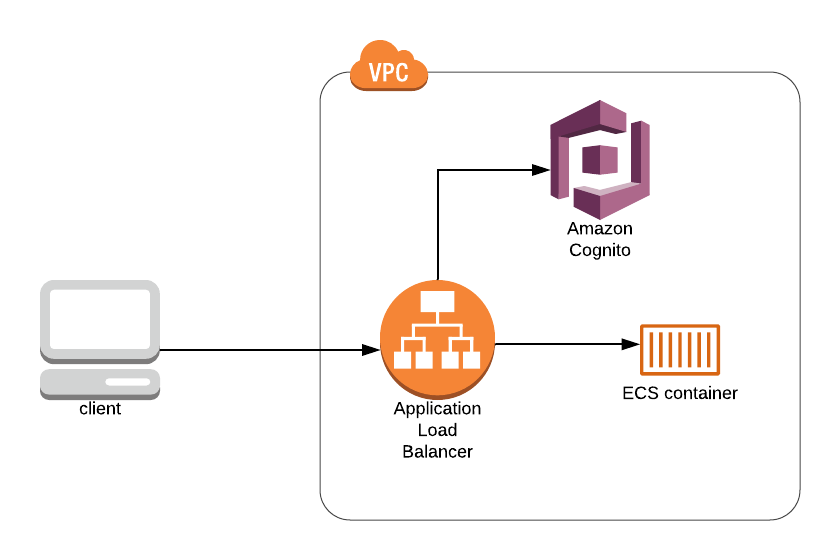

# cli-example

AWS CLI guide to provide an example for how to deploy an ECS Fargate Streamlit application authenticated with a local Cognito user pool.



## Prerequisites for guides

- AWS account
- User [AdministratorAccess](https://docs.aws.amazon.com/IAM/latest/UserGuide/access_policies_job-functions.html#jf_administrator)
- [AWS CLI](https://docs.aws.amazon.com/cli/latest/userguide/install-cliv2.html)
- [Build/Push Docker image to ECR](../example-app/README.md#buildingpushing-docker-image-to-aws)
- AWS default region of [`us-east-1`](https://docs.aws.amazon.com/cli/latest/userguide/cli-chap-configure.html#cli-quick-configuration)

## Setup

Before starting, be sure that you've followed the [instructions](../example-app/README.md#buildingpushing-docker-image-to-aws) for building the example Docker image and pushing to ECR.

**It is strongly recommend that you save the output of all the commands you run as there are values that will be ouput that will be needed for later commands.**

We will be building up to a working application by following these steps:

1. Setup AWS Cognito
    1. Create local user pool (instead of connecting to an IDP as that is not the purpose of this guide)
    1. Create an applicaiton to use to connect to Cognito
    1. Create a domain for Cognito to use
    1. Create first user for Cognito
1. Create Application Load Balancer (ALB)
    1. Create ALB
    1. Create DNS record for ALB (aws-example.streamlit.io in this guide)
    1. Create Target Group to connect ALB and container
    1. Request SSL certificate with Amazon Certificate Manager (ACM)
    1. Create DNS record with ACM DNS value to validate certificate (assumed that you have a domain you can use and know how to create DNS records)
    1. Create ALB Listener Rule to:
        1. Authenticate users with Cognito
        1. Route request to Target Group and ultimately to container
1. Create Elastic Container Service (ECS) application
    1. Create Fargate ECS cluster
    1. Create IAM role for Task Definition to use to pull Docker image from Elastic Container Registry (ECR)
    1. Register (create) Task Definition
    1. Create ECS service
1. Update default Security Group to allow internet traffic to connect

### Setup AWS Cognito

There are many ways to configure authentication, especially with Identity Providers (IDPs) through AWS Cognito but for now we will configure a local AWS Cognito user pool to use for securing access to the Streamlit application.

#### Create local user pool

```
aws cognito-idp create-user-pool \
  --pool-name streamlit-example-user-pool \
  --admin-create-user-config AllowAdminCreateUserOnly=true
```

This will return output like this:

```
{
    "UserPool": {
        "Id": "us-east-1_aaaaaaaaa",
        "Name": "streamlit-example-user-pool",
        "Policies": {
            "PasswordPolicy": {
                "MinimumLength": 8,
                "RequireUppercase": true,
                "RequireLowercase": true,
                "RequireNumbers": true,
                "RequireSymbols": true,
                "TemporaryPasswordValidityDays": 7
            }
        },
        "LambdaConfig": {},
        "LastModifiedDate": 1589585785.725,
        "CreationDate": 1589585785.725,
        "SchemaAttributes": [
            ...
            {
                "Name": "name",
                "AttributeDataType": "String",
                "DeveloperOnlyAttribute": false,
                "Mutable": true,
                "Required": false,
                "StringAttributeConstraints": {
                    "MinLength": "0",
                    "MaxLength": "2048"
                }
            },
            ...
            {
                "Name": "email",
                "AttributeDataType": "String",
                "DeveloperOnlyAttribute": false,
                "Mutable": true,
                "Required": false,
                "StringAttributeConstraints": {
                    "MinLength": "0",
                    "MaxLength": "2048"
                }
            },
            {
                "Name": "email_verified",
                "AttributeDataType": "Boolean",
                "DeveloperOnlyAttribute": false,
                "Mutable": true,
                "Required": false
            },
            ...
        ],
        "VerificationMessageTemplate": {
            "DefaultEmailOption": "CONFIRM_WITH_CODE"
        },
        "MfaConfiguration": "OFF",
        "EstimatedNumberOfUsers": 0,
        "EmailConfiguration": {
            "EmailSendingAccount": "COGNITO_DEFAULT"
        },
        "AdminCreateUserConfig": {
            "AllowAdminCreateUserOnly": true,
            "UnusedAccountValidityDays": 7
        },
        "Arn": "arn:aws:cognito-idp:us-east-1:123456789012:userpool/us-east-1_aaaaaaaaa"
    }
}
```

If you did not get the `Id` from the above command (first attribute in the `UserPool` object at the top of the output), it can be found by running the command below and locating the `streamlit-example-user-pool` and copying the `Id` value for creating the application client.

```
aws cognito-idp list-user-pools --max-results 10
```

#### Create an applicaiton to use to connect to Cognito

The above command provides the `Id` we will need for the next command to create the App client to be used by the ALB.

```
aws cognito-idp create-user-pool-client \
  --user-pool-id us-east-1_aaaaaaaaa \
  --client-name streamlit \
  --generate-secret \
  --allowed-o-auth-flows-user-pool-client \
  --allowed-o-auth-flows "code" \
  --allowed-o-auth-scopes "openid" \
  --explicit-auth-flows "ALLOW_REFRESH_TOKEN_AUTH" "ALLOW_USER_PASSWORD_AUTH" \
  --supported-identity-providers "COGNITO" \
  --callback-urls "https://aws-example.streamlit.io/oauth2/idpresponse" "https://streamlit.auth.us-east-1.amazoncognito.com/saml2/idpresponse"
```

The output of the command would look like this:

```
{
    "UserPoolClient": {
        "UserPoolId": "us-east-1_aaaaaaaaa",
        "ClientName": "streamlit",
        "ClientId": "abcdefghijklmnopqrstuvwxyz",
        "ClientSecret": "abcdefghijklmnopqrstuvwxyz01234567890abcdefghijklmn",
        "LastModifiedDate": 1589586829.921,
        "CreationDate": 1589586829.921,
        "RefreshTokenValidity": 30,
        "ExplicitAuthFlows": [
            "ALLOW_USER_PASSWORD_AUTH",
            "ALLOW_REFRESH_TOKEN_AUTH"
        ],
        "SupportedIdentityProviders": [
            "COGNITO"
        ],
        "CallbackURLs": [
            "https://aws-example.streamlit.io/oauth2/idpresponse",
            "https://streamlit.auth.us-east-1.amazoncognito.com/saml2/idpresponse",
        ],
        "AllowedOAuthFlows": [
            "code"
        ],
        "AllowedOAuthScopes": [
            "openid"
        ],
        "AllowedOAuthFlowsUserPoolClient": true
    }
}
```

Be sure to save off the value of the `ClientId` key for later when creating the listener on the ALB.

#### Create a domain for Cognito to use

Next we'll create a domain for use by the App client (this will not return any output).

```
aws cognito-idp create-user-pool-domain \
  --user-pool-id us-east-1_aaaaaaaaa \
  --domain streamlit
```

#### Create first user for Cognito

Finally, let's create our first user.

1. Substitute `newuser` with your desired username (could be your email)
1. Substitute `newuser@streamlit.io` with your email so you will get the temporary password

```
aws cognito-idp admin-create-user \
  --user-pool-id us-east-1_aaaaaaaaa \
  --username newuser@streamlit.io \
  --user-attributes Name=email,Value=newuser@streamlit.io \
  --desired-delivery-mediums "EMAIL"
```

This will return the user information:

```
{
    "User": {
        "Username": "newuser@streamlit.io",
        "Attributes": [
            {
                "Name": "sub",
                "Value": "b090cc58-bed2-44cf-8672-93d0c265f391"
            },
            {
                "Name": "email",
                "Value": "newuser@streamlit.io"
            }
        ],
        "UserCreateDate": 1589587141.158,
        "UserLastModifiedDate": 1589587141.158,
        "Enabled": true,
        "UserStatus": "FORCE_CHANGE_PASSWORD"
    }
}
```

### Create Application Load Balancer (ALB)

Now that we've configured our Cognito local user pool, App client, and domain, we can configure the ALB. This guide will assume that we can use the default Virtual Private Cloud (VPC) created with your AWS account. First we'll need to get two default public subnets:

```
aws ec2 describe-subnets \
  --filters "Name=availability-zone,Values=us-east-1a,us-east-1b" \
  --query 'Subnets[*].SubnetId'
```

The above will provide a list of subnets:

```
[
    "subnet-1111aaaa",
    "subnet-bbbb2222"
]
```

Use the two subnets in the next command to create the load balancer:

#### Create ALB
```
aws elbv2 create-load-balancer \
  --name streamlit-example-alb \
  --subnets subnet-1111aaaa subnet-bbbb2222
```

This will return output like this:

```
{
    "LoadBalancers": [
        {
            "LoadBalancerArn": "arn:aws:elasticloadbalancing:us-east-1:123456789012:loadbalancer/app/streamlit-example-alb/abcdefghijklmnop",
            "DNSName": "streamlit-example-alb-480146020.us-east-1.elb.amazonaws.com",
            "CanonicalHostedZoneId": "Z35SXDOTRQ7X7K",
            "CreatedTime": "2020-05-16T00:04:13.340Z",
            "LoadBalancerName": "streamlit-example-alb",
            "Scheme": "internet-facing",
            "VpcId": "vpc-abcd1234",
            "State": {
                "Code": "provisioning"
            },
            "Type": "application",
            "AvailabilityZones": [
                {
                    "ZoneName": "us-east-1a",
                    "SubnetId": "subnet-1111aaaa",
                    "LoadBalancerAddresses": []
                },
                {
                    "ZoneName": "us-east-1b",
                    "SubnetId": "subnet-bbbb2222",
                    "LoadBalancerAddresses": []
                }
            ],
            "SecurityGroups": [
                "sg-aabbccdd"
            ],
            "IpAddressType": "ipv4"
        }
    ]
}
```

#### Create DNS record for ALB

Using the `DNSName` from the output above, we're going to create a `CNAME` record for our application pointing `aws-example.streamlit.io` to the value `streamlit-example-alb-480146020.us-east-1.elb.amazonaws.com`.

#### Create Target Group to connect ALB and container

Before creating the Target Group, we will first need to get the default VPC created with the account:

```
aws ec2 describe-vpcs --query 'Vpcs[*].VpcId'
```

This will return output like this:

```
[
    "vpc-abcd1234"
]
```

Create the Target Group that will be used in the listener on the ALB and to which the Elastic Container Service Fargate applications will be connected.

```
aws elbv2 create-target-group \
  --name streamlit-example \
  --protocol HTTP \
  --port 8501 \
  --vpc-id vpc-abcd1234 \
  --target-type ip
```

This will return output like this:

```
{
    "TargetGroups": [
        {
            "TargetGroupArn": "arn:aws:elasticloadbalancing:us-east-1:123456789012:targetgroup/streamlit-example/0123456789abcdef",
            "TargetGroupName": "streamlit-example",
            "Protocol": "HTTP",
            "Port": 8501,
            "VpcId": "vpc-abcd1234",
            "HealthCheckProtocol": "HTTP",
            "HealthCheckPort": "traffic-port",
            "HealthCheckEnabled": true,
            "HealthCheckIntervalSeconds": 30,
            "HealthCheckTimeoutSeconds": 5,
            "HealthyThresholdCount": 5,
            "UnhealthyThresholdCount": 2,
            "HealthCheckPath": "/",
            "Matcher": {
                "HttpCode": "200"
            },
            "TargetType": "ip"
        }
    ]
}
```

#### Request SSL certificate with Amazon Certificate Manager (ACM)

In order to use Cognito authentication with your ALB, it is required that you use TLS on the ALB listener. In order to configure TLS, we will need a SSL certificate which can be requested/managed through the Amazon Certificate Manager service (replacing `streamlit.io` with your domain).

```
aws acm request-certificate \
  --domain-name streamlit.io \
  --subject-alternative-names "*.streamlit.io" \
  --validation-method DNS
```

This will return output like this:

```
{
    "CertificateArn": "arn:aws:acm:us-east-1:123456789012:certificate/aaaaaaaa-1111-2222-3333-bbbbbbbbbbbb"
}
```

####  Create DNS record with ACM DNS value to validate certificate

This will create a DNS record that will need to be added to your domain. Use the Amazon Resource Name (ARN) from the command above to query and get the DNS CNAME record you need to add.

```
aws acm describe-certificate \
  --certificate-arn arn:aws:acm:us-east-1:123456789012:certificate/aaaaaaaa-1111-2222-3333-bbbbbbbbbbbb \
  --query 'Certificate.DomainValidationOptions[0]'
```

This will return output like this:

```
{
    "DomainName": "streamlit.io",
    "ValidationDomain": "streamlit.io",
    "ValidationStatus": "PENDING_VALIDATION",
    "ResourceRecord": {
        "Name": "_fe11e6d33b981de0a491ad26bcd6ba11.streamlit.io.",
        "Type": "CNAME",
        "Value": "_4ace5aa56fec33b8cb9945bf19d22dd5.auiqqraehs.acm-validations.aws."
    },
    "ValidationMethod": "DNS"
}
```

Use the `ResourceRecord` information to create the DNS record to validate the certificate. This might take a bit for ACM to validate the certificate but keep checking the status of the certificate by running the `aws acm describe-certificate` command and waiting until the output returns `SUCCESS` for the `ValidationStatus` like the below example output:

```
{
    "DomainName": "streamlit.io",
    "ValidationDomain": "streamlit.io",
    "ValidationStatus": "SUCCESS",
    "ResourceRecord": {
        "Name": "_fe11e6d33b981de0a491ad26bcd6ba11.streamlit.io.",
        "Type": "CNAME",
        "Value": "_4ace5aa56fec33b8cb9945bf19d22dd5.auiqqraehs.acm-validations.aws."
    },
    "ValidationMethod": "DNS"
}
```

#### Create ALB Listener Rule

Next we will create Listener on the ALB. For this we will need:

- certificate ARN (used above)
- ALB ARN
- Target Group ARN
- Cognito User Pool ARN (e.g. `arn:aws:cognito-idp:us-east-1:123456789012:userpool/us-east-1_aaaaaaaaa` where you use the `Id` to replace the `us-east-1_aaaaaaaa` from above)
- Cognito User Pool Client ID
- Cognito User Pool Domain

Get your ALB ARN

```
aws elbv2 describe-load-balancers \
  --names streamlit-example-alb \
  --query 'LoadBalancers[0].LoadBalancerArn'
```

This will return output like this:

```
"arn:aws:elasticloadbalancing:us-east-1:123456789012:loadbalancer/app/streamlit-example-alb/abcdefghijklmnop"
```

Get your Target Group ARN
```
aws elbv2 describe-target-groups \
  --names streamlit-example \
  --query 'TargetGroups[0].TargetGroupArn'
```

This will return output like this:

```
"arn:aws:elasticloadbalancing:us-east-1:123456789012:targetgroup/streamlit-example/0123456789abcdef"
```

We'll create an `actions.json` file to be used when creating the listener:

```actions.json
[
  {
    "Type": "authenticate-cognito",
    "AuthenticateCognitoConfig": {
      "UserPoolArn": "arn:aws:cognito-idp:us-east-1:123456789012:userpool/us-east-1_aaaaaaaaa",
      "UserPoolClientId": "abcdefghijklmnopqrstuvwxyz",
      "UserPoolDomain": "streamlit",
      "SessionCookieName": "AWSELBAuthSessionCookie",
      "SessionTimeout": 3600,
      "Scope": "openid",
      "OnUnauthenticatedRequest": "authenticate"
    },
    "Order": 1
  },
  {
    "Type": "forward",
    "TargetGroupArn": "arn:aws:elasticloadbalancing:us-east-1:123456789012:targetgroup/streamlit-example/0123456789abcdef",
    "Order": 2
  }
]
```

Use the values retrieved above to create the listener:

```
aws elbv2 create-listener \
  --load-balancer-arn arn:aws:elasticloadbalancing:us-east-1:123456789012:loadbalancer/app/streamlit-example-alb/abcdefghijklmnop \
  --protocol HTTPS
  --port 443
  --ssl-policy ELBSecurityPolicy-TLS-1-2-Ext-2018-06
  --certificates CertificateArn=arn:aws:acm:us-east-1:123456789012:certificate/aaaaaaaa-1111-2222-3333-bbbbbbbbbbbb \
  --default-actions file://actions.json
```

This will return output like this:

```
{
    "Listeners": [
        {
            "ListenerArn": "arn:aws:elasticloadbalancing:us-east-1:123456789012:listener/app/streamlit-example-alb/abcdefghijklmnop/abcdef0123456789",
            "LoadBalancerArn": "arn:aws:elasticloadbalancing:us-east-1:123456789012:loadbalancer/app/streamlit-example-alb/abcdefghijklmnop",
            "Port": 443,
            "Protocol": "HTTPS",
            "Certificates": [
                {
                    "CertificateArn": "arn:aws:acm:us-east-1:123456789012:certificate/aaaaaaaa-1111-2222-3333-bbbbbbbbbbbb"
                }
            ],
            "SslPolicy": "ELBSecurityPolicy-TLS-1-2-Ext-2018-06",
            "DefaultActions": [
                {
                    "Type": "authenticate-cognito",
                    "AuthenticateCognitoConfig": {
                        "UserPoolArn": "arn:aws:cognito-idp:us-east-1:123456789012:userpool/us-east-1_aaaaaaaaa",
                        "UserPoolClientId": "abcdefghijklmnopqrstuvwxyz",
                        "UserPoolDomain": "streamlit",
                        "SessionCookieName": "AWSELBAuthSessionCookie",
                        "Scope": "openid",
                        "SessionTimeout": 3600,
                        "OnUnauthenticatedRequest": "authenticate"
                    },
                    "Order": 1
                },
                {
                    "Type": "forward",
                    "TargetGroupArn": "arn:aws:elasticloadbalancing:us-east-1:123456789012:targetgroup/streamlit-example/0123456789abcdef",
                    "Order": 2,
                    "ForwardConfig": {
                        "TargetGroups": [
                            {
                                "TargetGroupArn": "arn:aws:elasticloadbalancing:us-east-1:123456789012:targetgroup/streamlit-example/0123456789abcdef",
                                "Weight": 1
                            }
                        ],
                        "TargetGroupStickinessConfig": {
                            "Enabled": false
                        }
                    }
                }
            ]
        }
    ]
}
```

### Create Elastic Container Service (ECS) application

Now that we've configured the ALB with authentication, we now need to create the Elastic Container Service (ECS) cluster/service/task definition.

#### Create Fargate ECS cluster:
```
aws ecs create-cluster --cluster-name streamlit-fargate-example
```

This will return output like this:

```
{
    "cluster": {
        "clusterArn": "arn:aws:ecs:us-east-1:123456789012:cluster/streamlit-fargate-example",
        "clusterName": "streamlit-fargate-example",
        "status": "ACTIVE",
        "registeredContainerInstancesCount": 0,
        "runningTasksCount": 0,
        "pendingTasksCount": 0,
        "activeServicesCount": 0,
        "statistics": [],
        "tags": [],
        "settings": [
            {
                "name": "containerInsights",
                "value": "disabled"
            }
        ],
        "capacityProviders": [],
        "defaultCapacityProviderStrategy": []
    }
}
```

#### Create IAM role for Task Definition to use to pull Docker image from Elastic Container Registry (ECR)

Create the ECS task definition execution role:

```
aws iam create-role \
  --role-name streamlit-ecs-execution-role \
  --assume-role-policy-document '{"Version":"2012-10-17","Statement":[{"Effect":"Allow","Principal":{"Service":"ecs-tasks.amazonaws.com"},"Action":"sts:AssumeRole"}]}'
```

This will return output like:

```
{
    "Role": {
        "Path": "/",
        "RoleName": "streamlit-ecs-execution-role",
        "RoleId": "AROAWASDFXXZ3TG4ADMQC",
        "Arn": "arn:aws:iam::123456789012:role/streamlit-ecs-execution-role",
        "CreateDate": "2020-05-16T01:01:50Z",
        "AssumeRolePolicyDocument": {
            "Version": "2012-10-17",
            "Statement": [
                {
                    "Effect": "Allow",
                    "Principal": {
                        "Service": "ecs-tasks.amazonaws.com"
                    },
                    "Action": "sts:AssumeRole"
                }
            ]
        }
    }
}
```

Attach the `AmazonECSTaskExecutionRolePolicy` AWS managed policy to the role (this will not return any output):

```
aws iam attach-role-policy \
  --role-name streamlit-ecs-execution-role \
  --policy-arn arn:aws:iam::aws:policy/service-role/AmazonECSTaskExecutionRolePolicy
```

#### Register (create) Task Definition

Using the role that we just created above and the image that push (at the beginning of the guide), register the Task Definition:

```
aws ecs register-task-definition \
  --family streamlit-example \
  --network-mode awsvpc \
  --requires-compatibilities "FARGATE" \
  --cpu 256 \
  --memory 512 \
  --execution-role-arn arn:aws:iam::123456789012:role/streamlit-ecs-execution-role \
  --container-definitions '[{"name": "streamlit-example", "image": "123456789012.dkr.ecr.us-east-1.amazonaws.com/streamlit-example:1", "essential": true, "portMappings": [{"containerPort": 8501}]}]'
```

This will return output like this:

```
{
    "taskDefinition": {
        "taskDefinitionArn": "arn:aws:ecs:us-east-1:123456789012:task-definition/streamlit-example:1",
        "containerDefinitions": [
            {
                "name": "streamlit-example",
                "image": "123456789012.dkr.ecr.us-east-1.amazonaws.com/streamlit-example:1",
                "cpu": 0,
                "portMappings": [
                    {
                        "containerPort": 8501,
                        "hostPort": 8501,
                        "protocol": "tcp"
                    }
                ],
                "essential": true,
                "environment": [],
                "mountPoints": [],
                "volumesFrom": []
            }
        ],
        "family": "streamlit-example",
        "executionRoleArn": "arn:aws:iam::123456789012:role/streamlit-ecs-execution-role",
        "networkMode": "awsvpc",
        "revision": 1,
        "volumes": [],
        "status": "ACTIVE",
        "requiresAttributes": [
            {
                "name": "com.amazonaws.ecs.capability.ecr-auth"
            },
            {
                "name": "ecs.capability.execution-role-ecr-pull"
            },
            {
                "name": "com.amazonaws.ecs.capability.docker-remote-api.1.18"
            },
            {
                "name": "ecs.capability.task-eni"
            }
        ],
        "placementConstraints": [],
        "compatibilities": [
            "EC2",
            "FARGATE"
        ],
        "requiresCompatibilities": [
            "FARGATE"
        ],
        "cpu": "256",
        "memory": "512"
    }
}
```

We need the default security group to use when creating the ECS service.

```
aws ec2 describe-security-groups \
  --filters 'Name=group-name,Values=default' \
  --query 'SecurityGroups[*].GroupId'
```

This will return output like this:

```
[
    "sg-aabbccdd"
]
```

#### Create ECS service:

Using the Target Group ARN and the subnet and security group IDs, create the ECS service:

```
aws ecs create-service \
  --cluster streamlit-fargate-example \
  --service-name streamlit-example \
  --launch-type "FARGATE" \
  --desired-count 1 \
  --task-definition streamlit-example \
  --load-balancers targetGroupArn=arn:aws:elasticloadbalancing:us-east-1:123456789012:targetgroup/streamlit-example/abcde01234567890,containerName=streamlit-example,containerPort=8501 \
  --network-configuration awsvpcConfiguration={subnets=[subnet-1111aaaa,subnet-bbbb2222],securityGroups=[sg-aabbccdd],assignPublicIp=ENABLED}
```

This will return output like this:

```
{
    "service": {
        "serviceArn": "arn:aws:ecs:us-east-1:123456789012:service/streamlit-example",
        "serviceName": "streamlit-example",
        "clusterArn": "arn:aws:ecs:us-east-1:123456789012:cluster/streamlit-fargate-example",
        "loadBalancers": [
            {
                "targetGroupArn": "arn:aws:elasticloadbalancing:us-east-1:123456789012:targetgroup/streamlit-example/abcde01234567890",
                "containerName": "streamlit-example",
                "containerPort": 8501
            }
        ],
        "serviceRegistries": [],
        "status": "ACTIVE",
        "desiredCount": 1,
        "runningCount": 0,
        "pendingCount": 0,
        "launchType": "FARGATE",
        "platformVersion": "LATEST",
        "taskDefinition": "arn:aws:ecs:us-east-1:123456789012:task-definition/streamlit-example:1",
        "deploymentConfiguration": {
            "maximumPercent": 200,
            "minimumHealthyPercent": 100
        },
        "deployments": [
            {
                "id": "ecs-svc/0123456789012345678",
                "status": "PRIMARY",
                "taskDefinition": "arn:aws:ecs:us-east-1:123456789012:task-definition/streamlit-example:1",
                "desiredCount": 1,
                "pendingCount": 0,
                "runningCount": 0,
                "createdAt": 1589591611.902,
                "updatedAt": 1589591611.902,
                "launchType": "FARGATE",
                "platformVersion": "1.3.0",
                "networkConfiguration": {
                    "awsvpcConfiguration": {
                        "subnets": [
                            "subnet-1111aaaa",
                            "subnet-bbbb2222"
                        ],
                        "securityGroups": [
                            "sg-aabbccdd"
                        ],
                        "assignPublicIp": "ENABLED"
                    }
                }
            }
        ],
        "roleArn": "arn:aws:iam::123456789012:role/aws-service-role/ecs.amazonaws.com/AWSServiceRoleForECS",
        "events": [],
        "createdAt": 1589591611.902,
        "placementConstraints": [],
        "placementStrategy": [],
        "networkConfiguration": {
            "awsvpcConfiguration": {
                "subnets": [
                    "subnet-1111aaaa",
                    "subnet-bbbb2222"
                ],
                "securityGroups": [
                    "sg-aabbccdd"
                ],
                "assignPublicIp": "ENABLED"
            }
        },
        "healthCheckGracePeriodSeconds": 0,
        "schedulingStrategy": "REPLICA",
        "enableECSManagedTags": false,
        "propagateTags": "NONE"
    }
}
```

### Update default Security Group to allow internet traffic to connect

Finally, update the default security group to allow ingress traffic (this will not return any output):

```
aws ec2 authorize-security-group-ingress \
  --group-name default \
  --protocol tcp \
  --port 443 \
  --cidr 0.0.0.0/0
```

### Login to newly created application

Check your newly deployed application (https://aws-example.streamlit.io for this guide).

You will be prompted to login with the username that we created earlier. You should have gotten an email with your temporary password.
